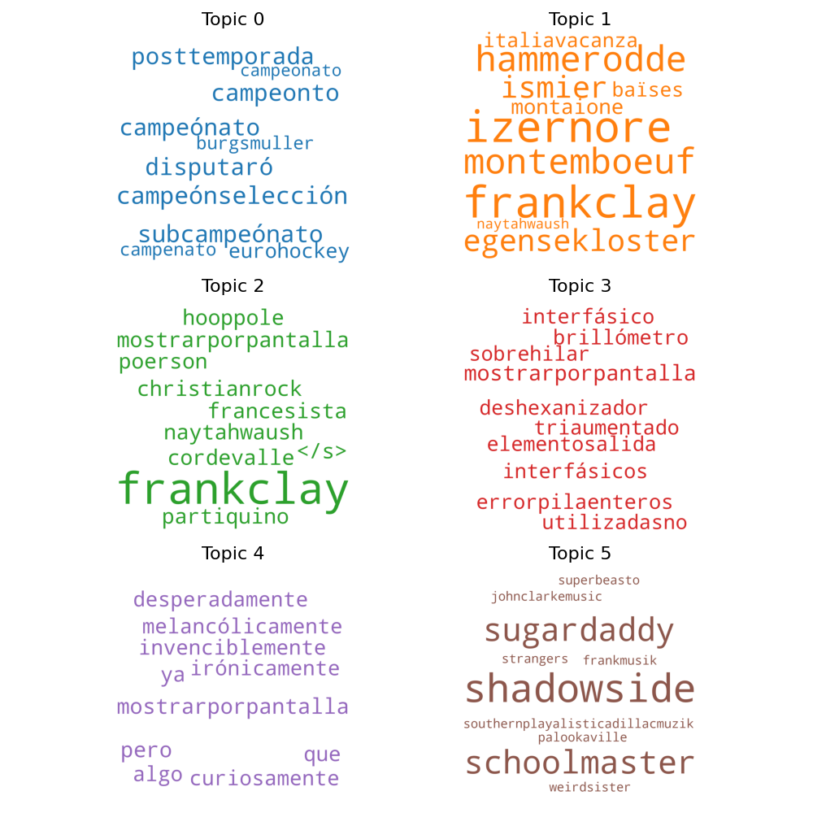
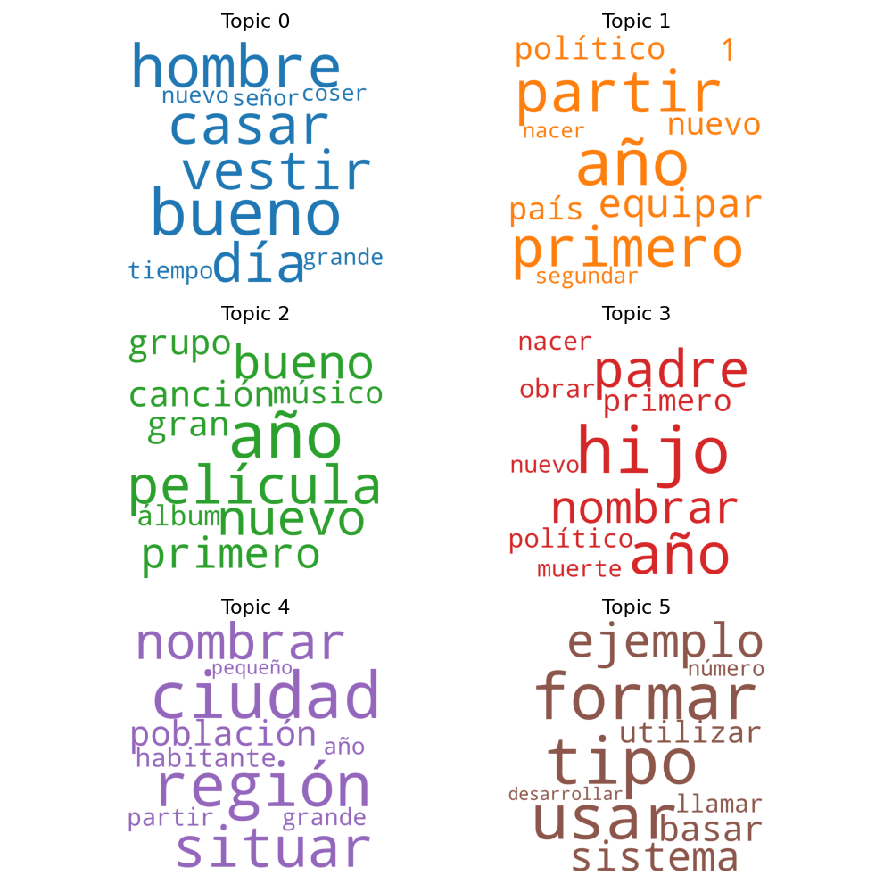

# Associate Data Scientist - Technical Test

## Objective 1

_Create a document categorization classifier for the different contexts of the documents. You will be addressing this objective at context level,
regardless of the language the documents are written in._

Here are the steps taken to build the document classification algorithm:

-   **Preliminary text cleaning**. Even though some texts had non natural language characters or just noisy words, I didn't spend too much time finding all the regexp to make the texts as clean as possible.
-   **Language detection**: The provided corpus has documents in Spanish, English and French, but at prediction time we won't necessarily know the language of the document to classify. Thus, we detect the language of the documents using the [langdetect](https://github.com/Mimino666/langdetect) library. The algorithm used is not perfect and a ML approach would deliver better results.
-   **Translation**: I've decided to use a pretrained model for machine translation and the translate all the texts to the same language. For some reason, I couldn't find a MarianMT pretrained model to translate from Spanish to English, so I decided to translate all the documents to Spanish instead. Credits: [Helsinki-NLP](https://huggingface.co/Helsinki-NLP)
-   **Normalization**:
    -   Tokenize the Spanish text using NLTK's `word_tokenize`
    -   Lowercase the tokens
    -   Remove duplicated tokens. This is specially important for translated documents, because sometimes we get translations in which an unwanted behavior of the model generates sequences of words repeated a lot of times
    -   Remove stopwords (based on NLTK's stopwords corpus for Spanish)
-   **Document vectorization**: There are several techniques that can be used to transform a document into a vector, such as BOW, tf-idf, doc2vec, etc., but I decided to go with a simple approach: a vector of 300 dimensions is calculated for each document by averaging the word embeddings of the normalized text (i.e. unique "meaningful" tokens). Doing this ignores the order of the words, but that is fine for the task of classification. Specially, I used the [FastText](https://github.com/facebookresearch/fastText) embeddings from SBWC (credits: _Cristian Cardellino: Spanish Billion Words Corpus and Embeddings (March 2016), &lt;<https://crscardellino.github.io/SBWCE/>_ )
-   **Classification model**: I decided to use [XGBoost](https://arxiv.org/pdf/1603.02754.pdf) with a softmax activation. It is probably not the best algorithm for this problem, but it worked pretty well out-of-the-box with very few fine-tuning. Also, given the number of training samples (around 20k), it'd been a bit hard to train a deep learning algorithm without fine-tuning a pretrained model using transfer learning.

-   **Evaluation of the results**: After preprocessing the corpus, we were left with 23040 samples. I used the hold-out method to split the data, so a 90% (20736 samples) were used to train the model and the other 10% (2304) was used as test set. The following table has some of the metrics on the evaluation of the model on the test set. The overall results are not bad, with a F1-score of 0.93 in the weighted average, but the model performs notably worse on the 'Conference_papers' class, as it had less training samples to begin with.

|       Category      | precision | recall | f1-score | support |
| :-----------------: | :-------: | :----: | :------: | :-----: |
|        'APR'        |    0.92   |  0.93  |   0.92   |   591   |
| 'Conference_papers' |    0.91   |  0.82  |   0.87   |    74   |
|       'PAN11'       |    0.92   |  0.87  |   0.89   |   315   |
|     'Wikipedia'     |    0.96   |  0.97  |   0.96   |   1324  |
|       accuracy      |           |        |   0.94   |   2304  |
|      macro avg      |    0.93   |  0.90  |   0.91   |   2304  |
|     weighted avg    |    0.94   |  0.94  |   0.94   |   2304  |

## Objective 2

_Perform a topic model analysis on the provided documents. You will discover the hidden topics and describe them._

For this tasks, two approaches were taken:

### K-means of the document embeddings

The first one consists of a clustering of the documents based on the document embedding calculated for the classifier. That is, the average of the word embeddings of the words in the document. This array of document embeddings is then used to fit a **K-means** model with 6 centers for the sake of simplicity. To describe each of the clusters, we take the most similar 50 words in the embedding space of the pretrained FastText model and plot them in a word cloud.

As shown in the picture below, the results are not very promising and a possible explanation for that could be that:
1\. The FastText model is trained with the [Spanish Billion Words Corpus](http://crscardellino.github.io/SBWCE/), which is compiled from different corpora and resources on the Internet, so it contains words in other languages and typos.
2\. The words that are close to the average embedding of the words in a document are not necessarily good at explaining where this average came from. In this case, the words describing each topic are probably not even present in the documents.



### LDA

[Latent Dirichlet allocation](http://www.jmlr.org/papers/volume3/blei03a/blei03a.pdf) is probably the most extended algorithm for topic modelling in NLP. Not surprisingly, it gave better results than the previous approach, as shown below. The algorithm was also trained to cluster the documents into 6 topics:

-   **Topic 0**: Everyday stories
-   **Topic 1**: Geo-political documents
-   **Topic 2**: Music and Movies
-   **Topic 3**: Biographies
-   **Topic 4**: World places
-   **Topic 5**: Technology & Science documents



## Pre-requirements

First of all, you have to clone this repository. All commands mentioned in this document need to be run from the root folder of the repo, unless otherwise specified.

To run the code in this repository, you'll need a Python 3.7 runtime configured with the dependencies specified in the [requirements.txt](requirements.txt), which can be installed like so:

```bash
python3 -m pip install -r requirements.txt
```

You might also want to install PyTorch in the [specific method for your hardware and CUDA version](https://pytorch.org/get-started/locally/).

### SBWC word embeddings pretrained model

You'll have to download the [FastText embeddings from SBWC](http://dcc.uchile.cl/~jperez/word-embeddings/fasttext-sbwc.vec.gz) and place it in the `data/` directory at the root of this repository

### spaCy Spanish corpus

```bash
python3 -m spacy download en
```

## Optional downloads

### The corpus provided for the exercise

Just in case, I also uploaded this one to Google Drive, so all the data needed to reproduce the experiments is in the same place:

-   You can download it from [here](https://drive.google.com/file/d/1RAK9Z6dheGnEBQI8fRlhIFM7X8BQQz_3/view?usp=sharing)
-   Unzip the corpus into the `./data/documents_challenge/` folder

### Use documents pretranslated to Spanish

If you want to run the training of the document classifier or the topic modelling, you might want to download the translations of the documents provided for the test to Spanish instead of translating them yourself. If that's the case, you'll have to:

-   Download the [ZIP containing the translations to Spanish](https://drive.google.com/file/d/1V7v2SGQNlKXqf8cbz4Az_ab-nrRsk_jn/view?usp=sharing) from Google Drive
-   Unzip to `./data/translations_es/` (at the root of this repository). Note that this will have the same directory structure as the provided corpus

### Use pretrained models

Also, you might want to load the pickles of the models that I trained if you want to skip training and just run the predictions. The procedure is very similar:

-   Download the joblib pickles from [MEGA](https://mega.nz/folder/JI4SSYAY#YlQJo8tBOuvZgoY_TuZdFw) (my Google Drive ran out of space ☹️)
-   Move the models to the `data/` folder

## Running the code

### Translate the documents to Spanish

This will save make the translations and save them in separate file, with the same folder structure as in `documents_challenge.zip`, to the `./data/translations_es/` folder. Translating the whole corpus took around 20 hours on a single **12GB NVIDIA Tesla K80 GPU**, so it is strongly recommended to use a GPU of the same size.

```bash
python3 -m translation.make_translations
```

### Run the models

For the three models, you can run the training and the evaluation. Additionally for the document classifier, you can run interactive predictions. Run the models like so:

```bash
# <model>: document_classifier|kmeans_topic_modelling|lda_topic_modellling
# <execution_mode>: train|evaluate|predict
python3 -m models.<model> <execution_mode>

# For example:
python3 -m models.document_classifier predict
```

Also, you can run the scripts in the `tests/` folder. For example, the following command tests the DocumentClassifier on languages that were not included in the training corpus:

```bash
python3 -m tests.classify_documents_from_unseen_languages
```
